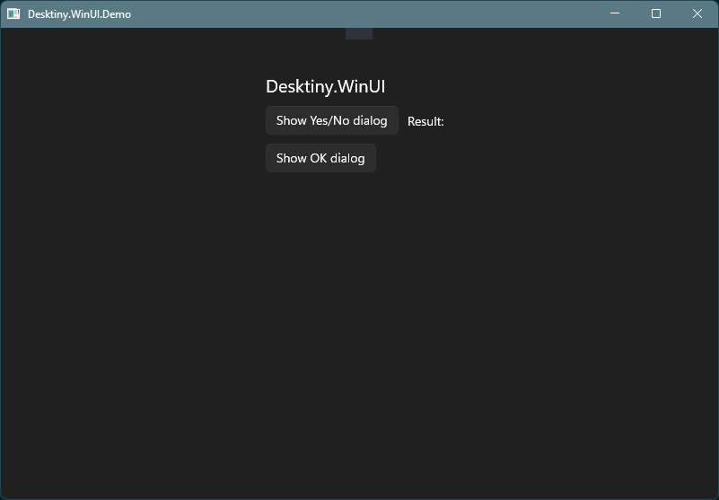
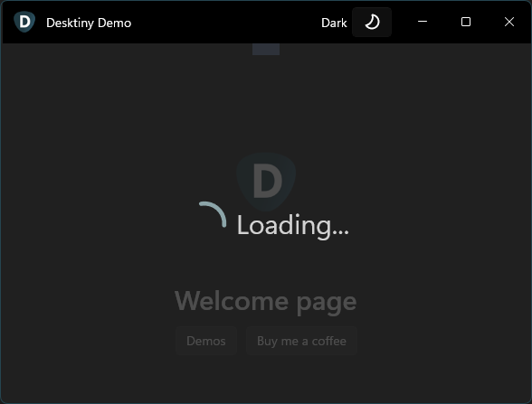

# Desktiny.WinUI

Boost your WinUI app development with the features offered by Desktiny.WinUI:

- Quick navigation setup.
- Add an option to change the theme of your app at runtime.
- Fast setup for multi-language apps.
- Add a progress bar or a custom control in front of the app content.
- Simple dialog service ready to use.

These and more features are available in Desktiny.WinUI. Using this library will make you to focus on your app and forget about complicated initial setups.

# Initial Setup

Implement `IAppWindow` interface in `App.xaml.cs`:

```csharp
public partial class App : Application, IAppWindow
{
    public Window MainWindow { get; private set; }

    protected override void OnLaunched(Microsoft.UI.Xaml.LaunchActivatedEventArgs args)
    {
        MainWindow = new MainWindow();
        MainWindow.Activate();
    }
}
```

Add `Winston` in `MainWindow.xaml`:

```xml
<Window x:Class="YourProject.MainWindow"
    ...>

    <!--Replace default content with Winston-->
    <winui:Winston>
        <TextBlock
            HorizontalAlignment="Center"
            VerticalAlignment="Center"
            FontSize="20">
            Hello World!
        </TextBlock>
    </winui:Winston>

</Window>
```

# Additional Setup

## Maximize app at startup

Set `MaximizeAtStartup` to `True`.

```xml
    <winui:Winston MaximizeAtStartup="True">
        <TextBlock
            HorizontalAlignment="Center"
            VerticalAlignment="Center"
            FontSize="20">
            Hello World!
        </TextBlock>
    </winui:Winston>
```

## Nocturne

`Winston` contains the `NocturneContent` property that you can use to display a control on top of your app. All the content in the window will reduce the opacity while `Nocturne` is visible. This is useful for scenarios that need to display a progress bar while loading stuff.

```xml
<winui:Winston IsNocturneVisible="False" MaximizeAtStartup="True">
    <StackPanel>
        <!--  Window content here ...  -->
    </StackPanel>
    <!--  Nocturne  -->
    <winui:Winston.NocturneContent>
        <StackPanel
            HorizontalAlignment="Center"
            VerticalAlignment="Center"
            Orientation="Horizontal"
            Spacing="10">
            <ProgressRing
                Width="50"
                Height="50"
                HorizontalAlignment="Center"
                VerticalAlignment="Center"
                IsIndeterminate="True" />
            <TextBlock VerticalAlignment="Center" FontSize="30">Loading...</TextBlock>
        </StackPanel>
    </winui:Winston.NocturneContent>
</winui:Winston>
```

Set `IsNocturneVisible` to True/False to display or hide `Nocturne`.




> The `IsNocturneVisible` property supports binding.

## Set up multi-language

The next steps are required for all WinUI 3 applications that need to provide multi-language support. Some steps are described in [Localize your WinUI 3 app](https://learn.microsoft.com/en-us/windows/apps/winui/winui3/localize-winui3-app) however the full implementation is not there.

The next steps will help you to support multi-language in your app.

Replace the `<Resource Language="x-generate"/>` with the supported languages for your app in `Package.appxmanifest`. For example:

```xml
<Resources>
    <Resource Language="en-US"/>
    <Resource Language="es-MX"/>
</Resources>
```

> You must open the `Package.appxmanifest` using your editor to edit the XML.

Add a `Strings` folder in your project. Then create a folder for each language you added in the `Package.appxmanifest` with the name of the language. Each language folder must contain a `Resources.resx` file:

```
ProjectFolder
├───Strings
    ├───en-US
    │       Resources.resw
    │
    └───es-MX
            Resources.resw
```

> Create the `Resources.resw` file using the option in Visual Studio: Right click on the language folder > Add > New Item > Installed > C# Items > WinUI > Resources File (.resw). If you don't see those options, you need to install `WinUI` components using Visual Studio Installer.

Now, you can add all language entries in your `Resources.resw` files. Visual Studio allows you to add entries easily. All entries must be in the form of `ENTRYID.PROPERTY`:

- ENTRYID is an arbitrary value.
- PROPERTY is the property name of the WinUI component where you'are going to use the value.

If you're going to use the value in a `TextBlock`, a valid entry will look like this: `WelcomeMessage.Text`. In this example I use `Text` because that's the property used in WinUI to set the text in a `TextBlock`. Other components might use a different property to set the text. For example, a `Button` uses the `Content`, so the previous entry for a `Button` must be `WelcomeMessage.Content`.

> Entries must be added in the `Resources.resw` file for each language. Otherwise, you app might display empty values for a language.

After setting up multi-language in your app, you can use one of the language classes that help you to manage multi-language in your code.

### LanguageService

This class helps you to retrieve the entry language values added in your app, so that you can use them in your code.

```csharp
LanguageServie languageService = new LanguageService();
string defaultTitle = _languageService.GetLangValue("DialogTitleDefault/Text");

//Later, you can use defaultTitle to set a control's text or bind a property
```

### DialogLangService and DialogLang

These classes help you to display simple dialogs for Yes/No options and simple information dialogs that support multi-language.

```csharp
//Replace 'DialogTest/Text' with the entry in your Resources.resw
//Dots must be replaced by slashes when using an entry in the code. This is default behavior in WinUI 3.
bool continueProcess = await DialogLang.ShowYesNoAsync("DialogTest/Text");

await DialogLang.ShowInformationAsync("DialogOKTest/Text");
```

> `DialogLangService` must be instanciated.

The next entries are provided by default in `Desktiny.WinUI` for `en-US` and `es-MX` languages:

- DialogTitleDefault.Text
- DialogCloseDefault.Text
- DialogCloseNo.Text
- DialogCloseYes.Text
- DialogTest.Text
- DialogOKTest.Text

You can override the values by creating the same entries in the `Resources.resw` files of your project. Make sure you set up your app to support multi-language.
